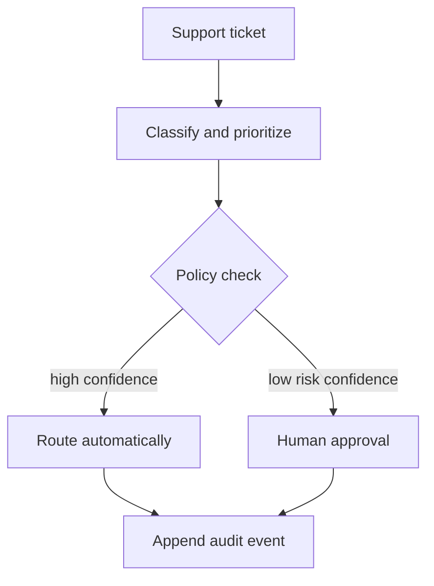

# Ops Copilot

A human-in-the-loop automation service for support-ticket triage. It classifies
incoming work, assigns priority and ownership, applies a confidence policy, and
records every decision in an append-only audit log.

## Quick start

```bash
python -m venv .venv
source .venv/bin/activate  # Windows PowerShell: .venv\Scripts\Activate.ps1
python -m pip install -e '.[dev]'
ops-copilot "Production login outage" "All users are locked out with an access error"
pytest -q
```

## Workflow



Sensitive actions—such as refunds, security issues, and legal topics—always
require approval. Low-confidence classifications do too, regardless of the
suggested queue.

## Engineering highlights

- A classifier interface that can be replaced by an LLM or fine-tuned model.
- Confidence thresholds separated from classification logic.
- Explicit policy checks for sensitive actions.
- Stable JSON output and append-only JSONL audit events.
- Tests for the automated path, approval path, and uncertainty path.

## Production extensions

- Serve the workflow through FastAPI and accept signed webhooks.
- Add idempotency storage and retry-safe queue publishing.
- Compare an LLM classifier against the local baseline on a labelled dataset.
- Add an approval UI and role-based access control.

